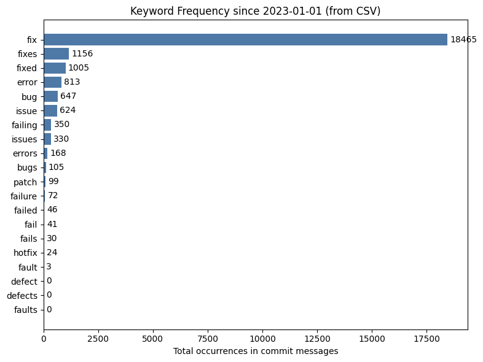
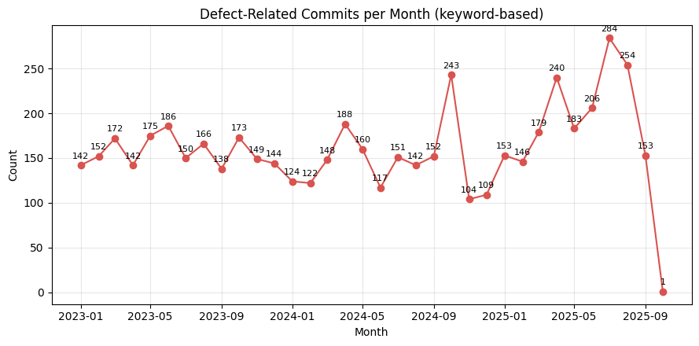
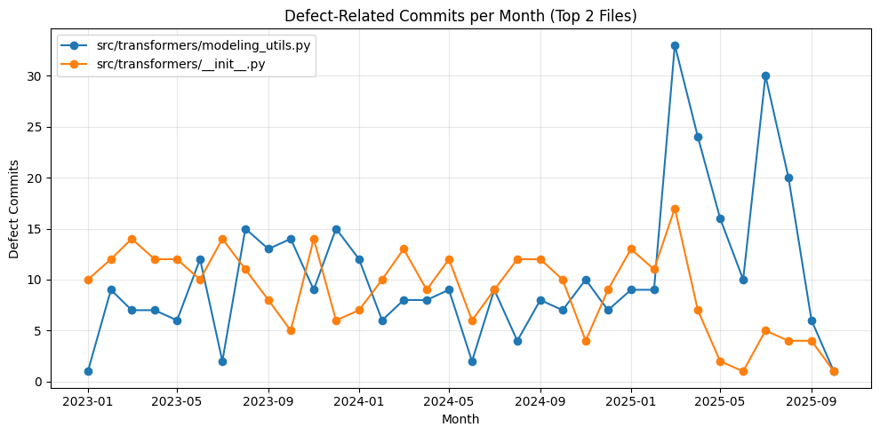
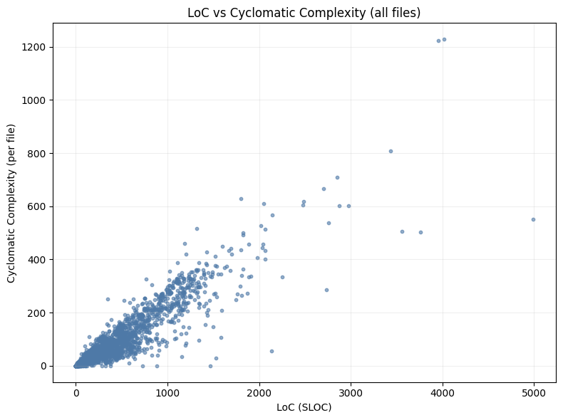
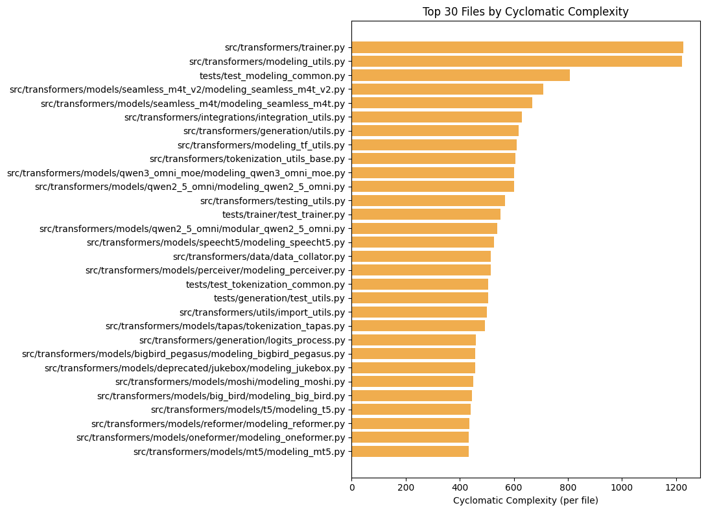
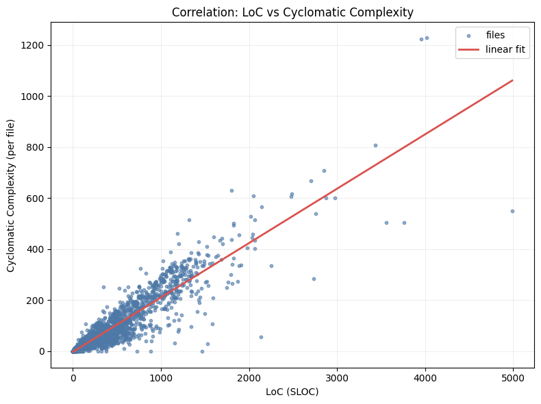
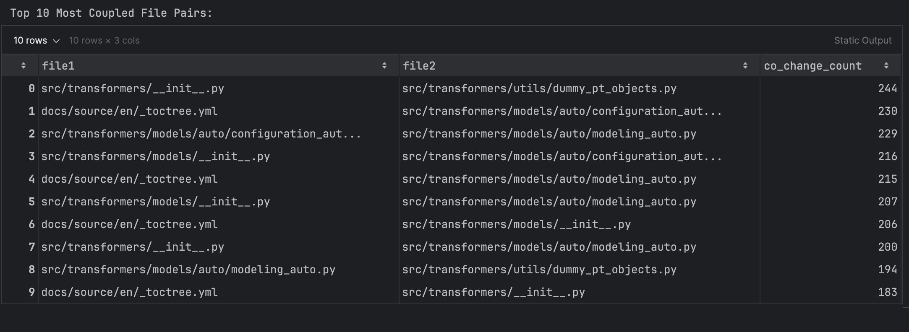
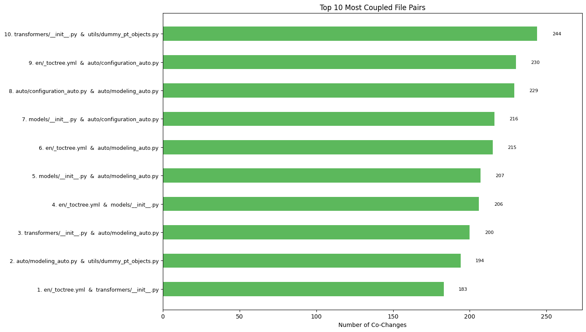
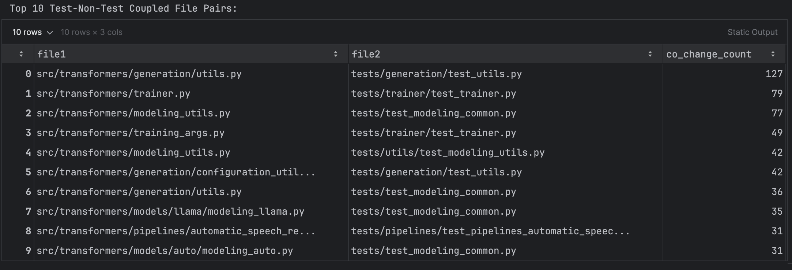
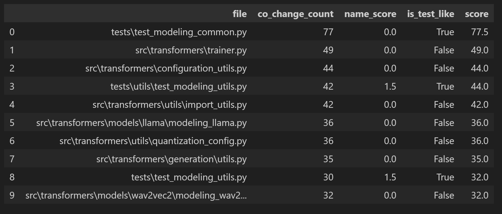

# FSS SE Assignment
## Group 8

## Task 1

### Task 1.2
#### Analyze these messages to detect the presence of specific keywords of your choice related to defect fixes.

Plot showing the occurance of the following Keywords ["fix", "fixes", "fixed", "bug", "bugs", "issue", "issues", "error", "errors",
"defect", "defects", "fault", "faults", "hotfix", "patch", "fail", "fails", "failed", "failing", "failure",]

### Task 1.3
#### Calculate and plot the total number of defects per month. Why do you think the number of defects dropped sharply in October 2025?

Total commits in 2025-10: 2 

There are only two commits in October 2025 in our mined dataset. Inspecting the most recent commit shows the subject 
Release v4.57.0. This indicates that on October 3rd, 2025, the project created the release tag v4.57.0. Since our 
analysis was performed on top of this tag (detached HEAD), we only see the commit history up to the release date. All 
commits made after October 3rd, 2025, were added to the main branch or to subsequent release branches, but these are not 
part of the checked-out tag. This explains the sudden drop in defect-related commits after October.

### Task 1.4
#### Calculate and plot the number of defects per month for the two files with the highest number of defects.
#### In which month were the most defects introduced? How would you explain it? Manually examine the repository for that month (e.g., change logs,releases, commit messages) and come up with a hypothesis.

The files with the highest numbers of defects are \['src/transformers/modeling_utils.py', 'src/transformers/\_\_init__.py'].

The most effects (33 in the file "modeling_utils.py") were introduced in March 2025.
The high number of bugs could be due to a series of large updates and refactors, including FlashAttention2 support, 
T5-Encoder changes, and attention module refactors, which probably introduced several defects which were later fixed, 
which can be seen by the numerous commits with ‘Fix’ in their messages.

### Task 1.5
#### What are the limitations of this method for finding defective hotspots?

People may use different keywords that are not included in the research for hotspots. There could also be the opposite 
scenario, where false positives are included. The keywords might be used in another context or with another meaning. 
Another limitation is that all defects are treated the same, so it is not possible to know what exactly the issue was 
or how severe the problem was. This is only possible by inspecting the changes or the exact message.

## Task 2

### Task 2.1
#### Select two complexity metrics of your choice.
 Metrics chosen: CC + LoC (SLOC)

### Task 2.2
#### Calculate the complexity of all .py files in the repository using the selected metrics

### Task 2.3
#### Visualize the complexity hotspots. The visualization should effectively convey which parts of the code are more complex or change more frequently. Feel free to use any visualization of your choice and explain the rationale behind your decision.

we used a horizontal bar chart sorted by Cyclomatic Complexity because it clearly highlights which files are the most complex in an easy format. Long file paths are readable horizontally, and ranking the bars makes the true complexity hotspots stand out immediately. This helps to quickly see where maintenance risk is highest and where refactoring efforts should be prioritized.

### Task 2.4
#### What can you say about the correlation between the two complexity measures in this repository? For example, if you selected CC and LoC, what can you say  for the statement “Files with more lines of code tend to have higher cyclomatic  complexity”?

Files with more lines of code tend to have higher cyclomatic complexity, and the data here shows a clear positive correlation.
As LoC increases, CC also rises because.
There are some exceptions but overall the trendline and correlation values confirm that bigger files are typically more complex in this repository.

### Task 2.5
#### A colleague of yours claims that “Files with higher complexity tend to be more defective”. What evidence can you present to support or reject this claim for the selected complexity measures in this repository?

By comparing defect counts per file with complexity metrics (CC and LoC), a positive correlation is observed.
Files with high CC and high LoC, such as modeling_utils.py, also have many defects.
This supports the claim that more complex files are more prone to defects, though correlation is not causation. Some high-complexity files may still have few defects due to careful development or extensive testing.

## Task 3

### Task 3.1
#### Calculate the logical coupling for each file pair in the repository. Visualize the 10 most coupled file pairs using a visualization of your choice that effectively conveys the coupling relationships. Select one of these 10 most coupled file pairs and comment on their relationship.

Example: src/transformers/modeling_utils.py ↔ src/transformers/attention.py
The most coupled pair is `src/transformers/__init__.py` & `src/transformers/utils/dummy_pt_objects.py`. These files are often changed together because `__init__.py` manages imports and exposes objects, while `dummy_pt_objects.py` provides placeholder implementations that need to be registered or updated in the package interface.

### Task 3.2
#### Repeat the steps of the bullet point above, but consider only file pairs where the one file is a Python test file, i.e., starts with “test ”, and the other is a Python non-test file. How would you explain this type of coupling? Is it a code smell that requires attention and signals potential refactoring opportunities or is it something different?

Frequent coupling between test and non-test files usually reflects normal development: tests are updated when code changes. This is not a code smell by itself, but if the coupling is very strong or tests are tightly bound to implementation details, it may signal that tests are too fragile or not modular enough. In most cases, such coupling is expected and healthy.

### Task 3.3
#### Writing tests is a time-consuming task and developers often omit it, thus, automated test generation tools have been implemented and are widely used. One of the most popular test generation tools for Python is Pynguin, that takes as input a .py file and generates passing tests for that file. Pynguin writes the generated tests to a new file in a separate folder, isolated from the project’s test suite. Suppose that you are tasked with implementing an option for Pynguin to place the tests directly in the project’s test suite, specifically in the test file that is most closely “related” with the input .py file. Discuss at least three (3) implementations for selecting the most “related” test file given a (non-test) .py file. You do not have to implement these options at this stage.

1) Logical coupling (co-change frequency)
- Pick the test file that most often changed together with the target file in past commits.
- Pros: reflects real maintenance relationships; easy to compute from `changes_df`.
- Cons: needs sufficient history; large commits can add noise. Consider normalizing or time-decay.

2) Static-analysis (imports / symbol references)
- Parse test files' ASTs and prefer tests that import or reference symbols from the target module.
- Pros: semantic and accurate when imports are explicit; works without long history.
- Cons: misses dynamic imports and runtime-generated tests; heavier to compute.

3) Naming / path heuristics and lexical similarity
- Use path mirroring (e.g., `src/x.py` -> `tests/test_x.py`), basename matches, or quick TF-IDF similarity between source/test texts.
- Pros: fast, deterministic; works well where conventions are followed.
- Cons: brittle in non-standard layouts; lexical matches can be noisy.

Recommended practical flow
- Try co-change (1) if sufficient history exists; fall back to static-analysis (2); otherwise use name/path heuristics (3).
- Return a ranked list of candidates rather than a single file; expose strategy options to users.

Integration notes
- Provide options to tune behavior: minimum co-change threshold, time decay window, or preferred directory mappings.
- When in doubt, write generated tests to a separate file or preview before inserting into an existing test file.

### Task 3.4
#### Select two of the three test placement implementations you proposed above. Where would they place automatically-generated tests for the src/transformers/generation/utils.py file?

We implement a small, practical heuristic that combines co-change frequency (logical coupling) with simple name/path heuristics to recommend candidate test files for a given source file. The code cell below defines `recommend_test_files(...)` and shows an example usage. This is intentionally lightweight and fast to run in the notebook environment.

Name-based matching: src/transformers/generation/utils.py and tests/transformers/generation/test_utils.py
Logical coupling: Place tests in the file that historically changes most with utils.py, e.g., tests/transformers/generation/test_generation.py if commits show frequent joint changes.

## LLM Prompts
Using pydriller to mine git commits from 2023-01-01 and save as a csv file.

Words related to fix, bug, error, issue

Generate a Plot showing the occurance of the following Keywords ["fix", "fixes", "fixed", "bug", "bugs", "issue", "issues", "error", "errors",
"defect", "defects", "fault", "faults", "hotfix", "patch", "fail", "fails", "failed", "failing", "failure",]

Plot defect related commmits per month. 

Calculate and visualize CC and LoC.
